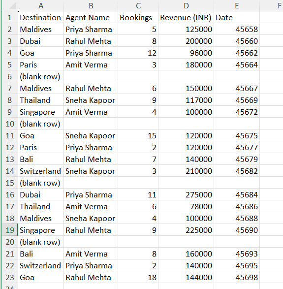
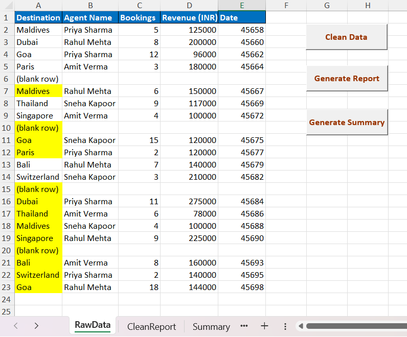
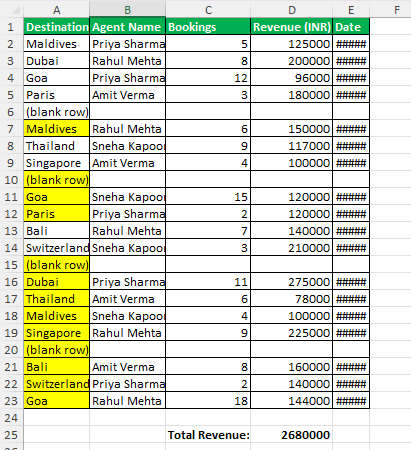
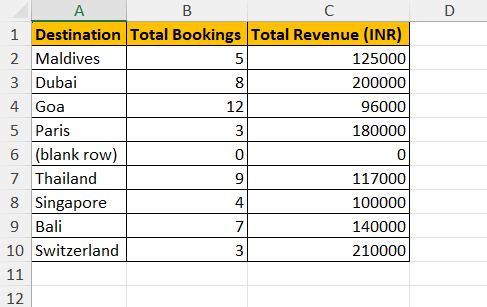

# Travel Agency Sales Dashboard Automator

An Excel VBA-based automation tool that streamlines travel sales data 
cleaning, report generation, and destination-wise summarization — 
all with a single click.

---

## Project Overview

Built to simulate real-world business reporting needs, this project 
automates repetitive Excel tasks using VBA Macros across 3 sheets — 
reducing manual effort and improving reporting accuracy.

---

## Features

- **Clean Data** — Auto-detects and hides blank rows, applies borders,
  bolds headers, and highlights duplicate destinations
- **Generate Report** — Copies clean data to a separate report sheet,
  calculates total revenue, and identifies the top-performing agent
- **Summary** — Builds a destination-wise breakdown of total bookings
  and revenue with auto-fit formatting

---

## Tech Stack

| Tool | Usage |
|---|---|
| Microsoft Excel | Data storage & dashboard |
| VBA Macros | Automation & logic |
| Form Control Buttons | User interaction |
| Scripting.Dictionary | Duplicate detection & aggregation |

---

## Project Structure
Travel-Sales-Dashboard-VBA/
├── TravelSalesDashboard.xlsm
├── README.md
└── screenshots/
├── raw-data.png
├── clean-data.png
├── clean-report.png
└── summary.png

---

## How to Use

1. Open `TravelSalesDashboard.xlsm`
2. Enable Macros when prompted
3. Go to **RawData** sheet
4. Click buttons in order:
   - **Clean Data** → Formats and cleans raw data
   - **Generate Report** → Creates report in CleanReport sheet
   - **Summary** → Builds destination summary in Summary sheet

---

## VBA Concepts Used

- Variables & Data Types (`String`, `Long`, `Double`)
- `For Next` Loops for row iteration
- `If / Else` conditions for blank & duplicate detection
- `CurrentRegion` for dynamic range selection
- `Scripting.Dictionary` for aggregation logic
- Multi-sheet operations (`Set ws = Sheets("name")`)
- `.Borders`, `.Interior.Color`, `.Font` formatting
- `MsgBox` for user feedback

---

## Screenshots

### Raw Data Sheet

### After Cleaning

### Generated Report

### Summary Sheet

---

## Author

**Payal Jain**  
[LinkedIn](https://linkedin.com/in/payal-jain-data-analyst) | 
[GitHub](https://github.com/Payaljain05)
